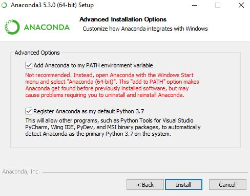
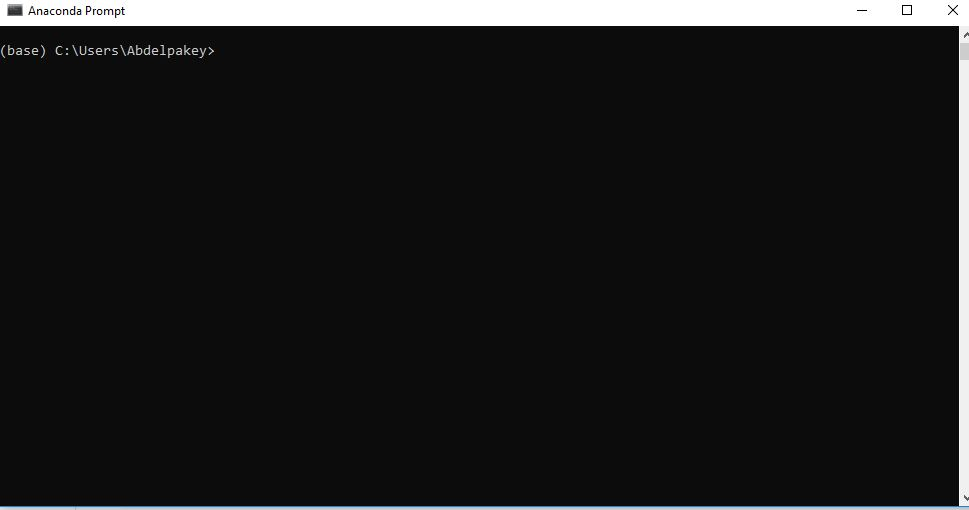
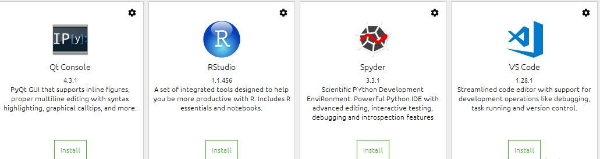
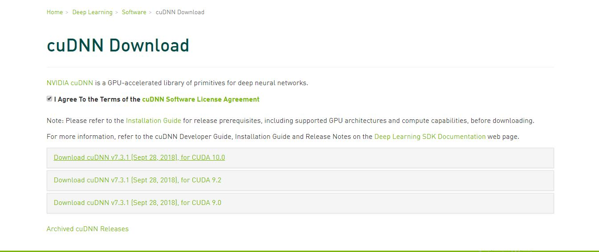

# Class-0
Installing Anaconda, Cuda, cuDNN, and Tensorflow on windows 7/8/10

Please make sure you have Nvidia GPU (from Windows Device Manager) if you dont have, you can use your CPU but becarful when you install Tensorflow, just use the CPU version.

## Prerequisites
- [x] Windows 7/8/10.
- [x] At least 8GB RAM.
- [x] At least Processor core I3.

## Softwares you need to download

- [x] Anaconda [Download](https://www.anaconda.com/download/#windows).
- [x] Tensorflow (you dont need to download), just follow the instructions later.

# For CPU ONLY

### Step-1 
#### install Anaconda
If you install Anaconda for the first time, please check the first option, otherwise don't check it.

It would take a while depending on your PC.

If you got a blank (black/white) spyder window after installation then do:

source activate (yourenv) conda install -c anaconda pyopengl (https://anaconda.org/anaconda/pyopengl)

If you got spyder startup problem or error

source activate (yourenv)
conda list
you will see  sqlite
then remove it 
conda remove sqlite 
then open-up your anaconda and install spyder again   
#### Open-up Anaconda prompt

#### Creat a new enviroment with any name (e.g. tf)
conda create -n tf python=3.6 pip
### Step-2
In Anaonda prompt type in

#### Activate tf 
or
#### Conda activate tf

#### Pip install tensorflow (for CPU)
If you enconter issues try to use 
#### conda install -c conda-forge tensorflow 

### How to test your Anaconda and Tensorflow
Open-up anaconda and install Spyder

In Spyder, type in 

    import tensorflow as tf
    hello = tf.constant('Hello tensorflow')
    with tf.Session() as sesh:
        print(sesh.run(hello)) 
    
You should see "Hello tensorflow"

# For GPU (Nvidia)

## Step-1
Please do the previous step-1

## step-2
Install CUDA:

First find if the GPU is compatible with Tensorflow GPU or not! from [Here](https://developer.nvidia.com/cuda-gpus)
- [x] Download and Install Cuda Toolkit from [here](https://developer.nvidia.com/cuda-downloads) and select the proper operating system for yor machine.
- [x] Download cuDNN that is compatible with your Cuda version that you have downloaded and installed by signing up on Nvidia Developer [Website](https://developer.nvidia.com/cudnn)

Note: you must have an account to download cuDNN (it's free)
- [x] Install cuDNN by extracting the contents of cuDNN into the Toolkit path (c:\users\yourname\programfiles\Nvidia Gpu Computing\ Toolkit\Cuda). There will be files that you have to replace in CUDA Toolkit Directory.

- [x] Add the path of cuda to your system variable.

## Step-3
Install Tensorflow

- [x] Open Spyder and creat an enviroment conda create -n tf python=3.6 pip

  This is for python ver 3.6 you can change it to be 3.7 but I never used pyhon 3.7 so I don't know if it's gonna work or not.
  
 - [x] Activate the created enviroment by "conda activate tf"
 - [x] Install tensorflow by "pip install tensorflow-gpu"
 - [x] Test tensorflow as follows 
 
            import tensorflow as tf
            hello = tf.constant('Hello tensorflow')
            with tf.Session() as sesh:
                print(sesh.run(hello))
   
   #### Identation must be consistent
   You shoud see Hello tensorflow
   
   If you have issues with tensorflow installation, please follow this [video](https://www.youtube.com/watch?v=uIm3DMprk7M&t=12s)
   
   IF you have any other issues you can look into my repositries I have highlighted the most common issues and their solutions.
   
   It's meant for Ubuntu but it might be useful for windows too [my Github](https://github.com/Abdelpakey?tab=repositories).
   
   If you don't have a machine with previous prerequisites or you dont have GPU you can use a free Gpu from Google [Colab](https://colab.research.google.com).
   
   Google colab has also TPU (tensor processing unit) which is faster than the typical GPU from 15 to 30 times. Use it only with large and deep networks otherwise you will not feel its speed and it might be slower.
   
   TPU works only with deep networks so don't expect that it would be much faster when it comes to object oriented, large databases ...
   
   

